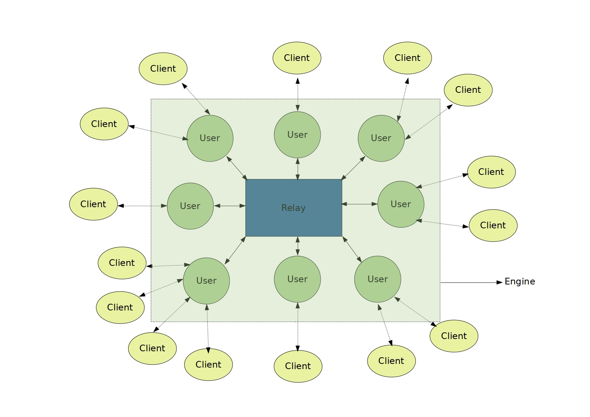

# Twitter Engine for Highly Concurrent Systems

#### Objective

The goal of this first part of a two part project is to implement the user/engine interaction and test it
using a simulator built over it. It is supposed to be a twitter clone with functionalities that mimic the
real social networking service. This is implemented using the concurrent programming model of
Elixir[1], The Actor Model.

#### Architecture

The Engine has three main parts:
* The Client:
	* This module is a GenServer that mimics the functionality of logged in application
	provided to the user by the service. For example Twitter for Android.
* The User:
	* This module is a GenServer that identifies as a part of the engine itself and demark the
	presence of a signed up user in the whole network. The customer/client can interact with
	it, yet it runs as a part of the engine.
* The Relay:
	* This is the component that forms the communication bridge between various signed up
	users. All the tweets, follow notifications etc. crossover from one user to the another via
	relay as the mediator.

#### Functionalities
We Provide the following functionalities:
* Signup for a new user
* Login/Logout for an existing user
* Follow for existing users from A to B
* Tweet by an existing user
* Live delivery of tweets if a user is logged in via a registered client
* Support for mentioning another user in tweets and retweets, which generates a notification for the person mentioned
* Support for creating new, following and using hastags in tweets and retweets
* Retweet by an existing user of an already existing tweet by another existing user
* Query tweets by an existing user on the basis of
	* Tweets that have been mentioned in
	* Tweets by users they follow
	* Tweets by hashtags they follow
	* Tweets they made
* Fetch one users followers as well as all the users they follow
* Population of an users timeline by leveraging the above functionality
* Deletion of a user if requested along with its followed-by table and its entry in all the other users’ followed-by tables

#### Modules
The above functionalities are provided through an intricate interplay of the modules, which are:

#### Observations

The above table and graph show how much time was taken for each user to receive a copy of a tweet on
its logged in client. Note that each user other than the one tweeting was subscribed to receive tweet. We
would also like to mention that, after the 5000 users mark, the CPU of the machine started to throttle
due to heat and hence the results after that are not on the same processor clock speed. This was tested
on an Intel i7-8750H hex core CPU.

#### Zipf Distribution of followers
In this project we have simulated a Zipf distribution of followers. The simulation has been done based on the number of followers/subscribers for all active users. We take the maximum subscribers a user can have as an input parameter and the user with most number of followers are simulated to have those many number of subscribers, and the user with the second most number of followers had maximum subscribers/2 and the user which is third in rank having maximum subscribers/3 and so on. This has been implemented using a reduce algorithm and accumulators.

#### Results
Even though we were able to host a maximum of 100,000 users on the test machine, we are certain that
this engine can easily do more due to its highly distributive nature, even within the engine. This Engine
provides a layered architecture which finally exposes a top layer API to host a twitter like engine along
with compatible clients.

#### Dependencies
* elixir~>1.9.2
* mix~>1.9.2

#### Preferred choice of OS
* GNU/Linux

#### References
[1] [Elixir](https://elixir-lang.org)

